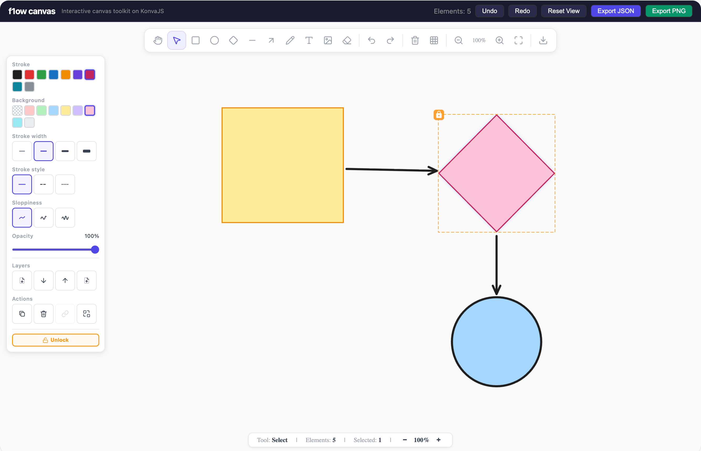

<p align="center">
  <h1 align="center">f1ow</h1>
  <p align="center">
    Interactive canvas drawing toolkit built on <strong>KonvaJS</strong> — drop-in React component for any project.
  </p>
</p>

<p align="center">
  <a href="https://www.npmjs.com/package/f1ow"></a>
  <a href="https://www.npmjs.com/package/f1ow"></a>
  <a href="https://github.com/nuumz/f1ow-canvas/blob/main/LICENSE"></a>
  <a href="https://github.com/nuumz/f1ow-canvas"></a>
</p>

<p align="center">
  
</p>

---

## Features

- **10 Drawing Tools** — Rectangle, Ellipse, Diamond, Line, Arrow, Free Draw, Text, Image, Eraser
- **Selection & Transform** — Click, drag, resize, rotate, multi-select
- **Smart Connectors** — Arrows/lines snap to shapes with auto-routing (sharp, curved, elbow)
- **11 Arrowhead Variants** — Triangle, circle, diamond, bar, crow's foot (ERD), and more
- **Pan & Zoom** — Hand tool, scroll-wheel, trackpad pinch, zoom-to-fit
- **Undo / Redo** — 100-step history
- **Rich Styling** — Stroke, fill, width, dash, opacity, roughness, fonts
- **Export** — PNG, SVG, JSON
- **Context Menu** — Built-in + extensible
- **Grouping & Locking** — Group/ungroup, lock/unlock
- **Real-Time Collaboration** — Optional CRDT via Yjs (experimental)
- **Fully Themeable** — Dark mode, custom colors, all via props
- **Zero CSS** — No external stylesheets required
- **TypeScript** — Full type safety with strict mode

## Installation

```bash
npm install f1ow
```

> **Peer dependencies:** `react` and `react-dom` ≥ 17

## Quick Start

```tsx
import { FlowCanvas } from "f1ow";

function App() {
  return (
    <div style={{ width: "100vw", height: "100vh" }}>
      <FlowCanvas onChange={(elements) => console.log(elements)} />
    </div>
  );
}
```

That's it — you get a full-featured canvas editor with toolbar, style panel, keyboard shortcuts, and grid out of the box.

## Props

| Prop | Type | Default | Description |
| --- | --- | --- | --- |
| `initialElements` | `CanvasElement[]` | `[]` | Preloaded elements (uncontrolled) |
| `elements` | `CanvasElement[]` | — | Controlled elements |
| `onChange` | `(elements) => void` | — | Elements changed |
| `onSelectionChange` | `(ids) => void` | — | Selection changed |
| `onElementCreate` | `(element) => void` | — | Element created |
| `onElementDelete` | `(ids) => void` | — | Elements deleted |
| `onElementDoubleClick` | `(id, element) => boolean` | — | Return `true` to prevent default |
| `width` / `height` | `number \| string` | `'100%'` | Canvas dimensions |
| `tools` | `ToolType[]` | all | Visible tools in toolbar |
| `defaultStyle` | `Partial<ElementStyle>` | — | Default style for new elements |
| `showToolbar` | `boolean` | `true` | Show toolbar |
| `showStylePanel` | `boolean` | `true` | Show style panel |
| `showStatusBar` | `boolean` | `true` | Show status bar |
| `showGrid` | `boolean` | `true` | Show grid |
| `enableShortcuts` | `boolean` | `true` | Enable keyboard shortcuts |
| `theme` | `Partial<FlowCanvasTheme>` | — | [Theme customization](#theming) |
| `readOnly` | `boolean` | `false` | Disable editing |
| `className` | `string` | — | Root container CSS class |
| `contextMenuItems` | `ContextMenuItem[]` or `(ctx) => ContextMenuItem[]` | — | Extra context menu items |
| `renderContextMenu` | `(ctx) => ReactNode` | — | Replace built-in context menu |
| `collaboration` | `CollaborationConfig` | — | Enable real-time collaboration |

## Ref API

Control the canvas programmatically via `ref`:

```tsx
import { useRef } from "react";
import type { FlowCanvasRef } from "f1ow";

const ref = useRef<FlowCanvasRef>(null);

<FlowCanvas ref={ref} />;
```

| Method | Returns | Description |
| --- | --- | --- |
| `getElements()` | `CanvasElement[]` | Get all elements |
| `setElements(elements)` | — | Replace all elements |
| `addElement(element)` | — | Add one element |
| `deleteElements(ids)` | — | Delete by IDs |
| `getSelectedIds()` | `string[]` | Get selected IDs |
| `setSelectedIds(ids)` | — | Set selection |
| `clearSelection()` | — | Deselect all |
| `setActiveTool(tool)` | — | Switch tool |
| `undo()` / `redo()` | — | History navigation |
| `zoomTo(scale)` | — | Set zoom level |
| `resetView()` | — | Reset pan & zoom |
| `scrollToElement(id, opts?)` | — | Center on element |
| `zoomToFit(ids?, opts?)` | — | Fit elements in view |
| `exportPNG()` | `string \| null` | Export as data URL |
| `exportSVG()` | `string` | Export as SVG string |
| `exportJSON()` | `string` | Export as JSON string |
| `importJSON(json)` | — | Load from JSON |
| `getStage()` | `Konva.Stage` | Raw Konva stage access |

## Keyboard Shortcuts

`⌘` = Cmd (Mac) / Ctrl (Windows/Linux)

| Tool Shortcuts | | Action Shortcuts | |
| --- | --- | --- | --- |
| `V` Select | `A` Arrow | `⌘Z` Undo | `⌘⇧1` Zoom to fit |
| `H` Hand | `P` Pencil | `⌘⇧Z` Redo | `⌘⇧2` Zoom to selection |
| `R` Rectangle | `T` Text | `⌘D` Duplicate | `⌘G` Group |
| `O` Ellipse | `I` Image | `⌘A` Select all | `⌘⇧G` Ungroup |
| `D` Diamond | `E` Eraser | `Del` Delete | `⌘⇧L` Lock toggle |
| `L` Line | `G` Grid | `⌘+/-/0` Zoom | `⌘]/[` Layer order |

## Theming

```tsx
<FlowCanvas
  theme={{
    canvasBackground: "#1a1a2e",
    gridColor: "#2a2a4a",
    selectionColor: "#7c3aed",
    toolbarBg: "rgba(26, 26, 46, 0.95)",
    toolbarBorder: "#2a2a4a",
    panelBg: "rgba(26, 26, 46, 0.95)",
    activeToolColor: "#7c3aed",
    textColor: "#e5e7eb",
    mutedTextColor: "#6b7280",
  }}
/>
```

All properties are optional — only override what you need.

## Context Menu

Append custom items or fully replace the built-in menu:

```tsx
// Add items
<FlowCanvas
  contextMenuItems={[
    { label: "My Action", action: (ctx) => console.log(ctx.selectedIds) },
  ]}
/>

// Full replacement
<FlowCanvas
  renderContextMenu={(ctx) => <MyCustomMenu {...ctx} />}
/>
```

## Collaboration (Experimental)

```tsx
<FlowCanvas
  collaboration={{
    roomId: "my-room",
    wsUrl: "wss://my-yjs-server.example.com",
    user: { id: "user-1", name: "Alice", color: "#e03131" },
  }}
/>
```

Provides CRDT-based real-time sync with cursor presence overlay. Requires a [Yjs WebSocket server](https://github.com/yjs/y-websocket).

## Element Types

`CanvasElement` is a discriminated union of 8 types:

**Shapes** — `rectangle`, `ellipse`, `diamond`
**Connectors** — `line`, `arrow` (with bindings, routing, arrowheads)
**Content** — `text`, `image`, `freedraw`

All elements share: `id`, `x`, `y`, `width`, `height`, `rotation`, `style`, `isLocked`, `isVisible`, `boundElements`, `groupIds`.

> Full type definitions are bundled in the package `.d.ts` files.

## Development

```bash
pnpm install       # Install dependencies
pnpm dev           # Dev server (demo app)
pnpm build:lib     # Build library → dist/
pnpm typecheck     # Type check (strict)
```

## Browser Support

Chrome/Edge ≥ 80 · Firefox ≥ 78 · Safari ≥ 14

## License

[MIT](LICENSE) © [Nuumz](https://github.com/nuumz)
